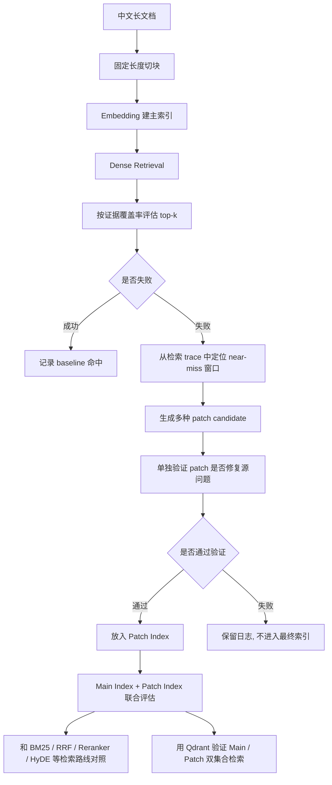

# RecallRAG

RecallRAG 是一个面向 RAG 证据召回断裂问题的检索修复实验项目。

它关注的不是“完全搜不到相关文档”，而是更隐蔽的一类失败：

> 相关文档已经进入 top-k，但答案证据被 chunk 边界切断，最终只召回了半截内容。

这类问题已有很多常见解决办法，例如增大 chunk size、增加 overlap、使用 parent-child chunking、相邻块扩展（neighbor expansion）、Hybrid Retrieval 或 reranker。RecallRAG 不主张这是一个独立的 RAG 范式，也不试图替代这些方法；它更像一个工程化补充方案：

> 在主索引不变的前提下，对失败 query 做诊断，定位局部 near-miss 窗口，生成可验证的 patch chunk，并把通过验证的 patch 放入旁路 Patch Index。

完整复现实验命令放在 [RUN_EXPERIMENTS.md](RUN_EXPERIMENTS.md)。README 只保留项目思路、关键结果和阅读入口。

## 整体流程



整体上，它是一个闭环：

```text
先发现失败 -> 定位可能断裂的位置 -> 生成局部修复块 -> 验证有效才保留 -> 再做完整对照
```

主索引不被直接改写。Patch Index 是一个旁路的小索引，只放通过验证的局部修复块。

## 核心问题

普通的 Recall@k 很多时候只看“有没有召回正确文档”。这个项目的评估更严格：

- top-k 里必须来自正确文档
- 这个 chunk 还要覆盖足够多的 gold evidence span
- 当前覆盖率阈值是 `0.65`

所以这里的 Recall@5 不是“找到了相关文档”就算成功，而是“找到了足够完整的证据块”才算成功。

## 方法

项目分成四步：

1. 先用普通 dense retrieval 做 baseline。
2. 对失败 query 做诊断，只用检索 trace 定位 near-miss 窗口，不用 gold span 去找 patch。
3. 在局部窗口生成 patch candidate，例如相邻块合并、相关句抽取、要点句、局部摘要。
4. 把 patch 放到旁路索引里验证，只保留能修复源问题且没有回归的 patch。

这里的重点不是“把所有上下文都塞进去”，而是用一个验证门控制 patch 是否真的值得进入检索系统。

## 主要结果

正式结论以 `case_zh_dureader_120/` 和 `runs/zh120_*` 为准。

`220/0` 是诊断设置，用来把 chunk 边界问题暴露出来：

| Route | Recall@5 | MRR | Hits |
|---|---:|---:|---:|
| `main` | 0.1417 | 0.0651 | 17 / 120 |
| `main + rerank` | 0.1333 | 0.0822 | 16 / 120 |
| `BM25` | 0.0667 | 0.0244 | 8 / 120 |
| `Dense + BM25` | 0.0917 | 0.0318 | 11 / 120 |
| `Dense + BM25 + RRF + rerank` | 0.1333 | 0.0822 | 16 / 120 |
| `HyDE + Dense + BM25 + RRF + rerank` | 0.1250 | 0.0739 | 15 / 120 |
| `main + patch` | 0.3417 | 0.1501 | 41 / 120 |
| `main + patch + rerank` | 0.3250 | 0.2001 | 39 / 120 |

后续实验补充了更强的切分和相邻块扩展对照。这个表更能说明项目边界：

| Route | Main chunks | Avg top-5 chars / query | Recall@5 | MRR | Hits |
|---|---:|---:|---:|---:|---:|
| `220/0` | 1634 | 1203.4 | 0.1417 | 0.0651 | 17 / 120 |
| `220/50` | 2066 | 1212.4 | 0.0917 | 0.0475 | 11 / 120 |
| `220/100` | 2854 | 1216.8 | 0.1000 | 0.0753 | 12 / 120 |
| `400/0` | 928 | 2011.2 | 0.5750 | 0.3279 | 69 / 120 |
| `600/0` | 634 | 2893.0 | 0.8833 | 0.5508 | 106 / 120 |
| `220/0 + 相邻块扩展` | 1634 | 3414.2 | 0.8750 | 0.5582 | 105 / 120 |
| `600/0 + 相邻块扩展` | 634 | 7597.8 | 1.0000 | 0.9153 | 120 / 120 |

在较强固定切分 `600/0` 上重新跑完整 patch 流程：

| Route | Total chunks | Selected patch chunks | Avg top-5 chars / query | Recall@5 | MRR | Hits |
|---|---:|---:|---:|---:|---:|---:|
| `600/0` | 634 | 0 | 2893.0 | 0.8833 | 0.5508 | 106 / 120 |
| `600/0 + patch` | 640 | 6 | 2942.1 | 0.9333 | 0.5715 | 112 / 120 |

配对检验结果：

- patch-source：`106 / 120 -> 112 / 120`，wins `6`，losses `0`，McNemar p-value `0.03125`
- held-out 改写 query：`107 / 120 -> 112 / 120`，wins `5`，losses `0`，McNemar p-value `0.0625`

held-out 这组结果只能视为正向信号，不应表述为强显著结论。

## 当前结论

本项目不主张“patch 打败所有 RAG 检索方案”。

更准确的结论是：

- `220/0` 能把答案断裂问题暴露出来，但不是最终强基线。
- 更大的 chunk 和相邻块扩展本身很强，能解决大部分问题。
- 如果只追求最高 Recall@5，这个数据集上 `600/0 + 相邻块扩展` 最强。
- patch 的价值在于：用很小的额外上下文和验证门，修复强基线后剩下的一部分失败。
- 它更像一个“失败后的局部修复层”，不是替代 BM25、RRF、reranker 或正常 chunk 调参。

## 目录结构

```text
recallrag/                主项目代码
scripts/                  数据构建、评估和分析脚本
tests/                    单元测试
runs/zh120_*/             主要实验的轻量结果文件
case_zh_dureader_120/     当前中文主数据集
RUN_EXPERIMENTS.md        复现实验命令
```

重点代码文件：

```text
recallrag/eval.py              Dense retrieval 和证据覆盖率评估
recallrag/diagnose.py          失败定位
recallrag/patch_index.py       patch 生成、验证和对比
recallrag/bm25.py              BM25 和 Dense+BM25 对照
recallrag/strong_baselines.py  RRF、rerank、HyDE 对照
recallrag/qdrant_backend.py    Qdrant 双集合检索
recallrag/reranker.py          本地 cross-encoder reranker
recallrag/cli.py               命令入口
```

## 环境

最低要求：

- Python `3.10+`
- 一个 OpenAI-compatible embedding 服务，地址为 `/v1/embeddings`

推荐环境：

- GPU，用于 reranker 实验
- `torch` 和 `transformers`
- 本地 Qdrant，用于 main/patch 双集合演示

安装：

```bash
python3 -m venv .venv
source .venv/bin/activate
python3 -m pip install --upgrade pip setuptools wheel
pip install -e .
pip install torch transformers
```

当前主实验配置：

| Component | Setting |
|---|---|
| embedding endpoint | `http://localhost:1234/v1/embeddings` |
| embedding model | `text-embedding-bge-large-zh-v1.5` |
| embedding dimension | `1024` |
| reranker model | `BAAI/bge-reranker-v2-m3` |
| HyDE model | `deepseek-v4-flash` |
| Qdrant URL | `http://localhost:6333` |

API key 不要写进代码。`.env.example` 里保留了变量名：

```bash
RECALLRAG_HYDE_API_KEY=
RECALLRAG_QUERY_REWRITE_API_KEY=
```

## 数据集

当前主数据集是 `case_zh_dureader_120/`。

| Field | Value |
|---|---|
| source | `zyznull/dureader-retrieval-ranking` dev subset |
| sample size | `120` |
| negatives per document | `4` |
| positive length range | `380` to `1400` |
| seed | `42` |

主要文件：

- `case_zh_dureader_120/eval/questions.jsonl`
- `case_zh_dureader_120/eval/questions_patch_source.jsonl`
- `case_zh_dureader_120/eval/questions_heldout.jsonl`
- `case_zh_dureader_120/source_metadata.json`

## 如何复现实验

所有命令集中在 [RUN_EXPERIMENTS.md](RUN_EXPERIMENTS.md)。

复现实验入口：

1. 运行 `220/0` 诊断版，用于观察 chunk 边界导致的证据断裂。
2. 运行 `400/0`、`600/0`、overlap 和相邻块扩展，用于确认更强切分策略下的效果。
3. 运行 `600/0 + patch`、held-out 和 Qdrant 双集合，用于验证 patch 在强基线之后的增量和工程形态。

测试命令：

```bash
python3 -m unittest discover -s tests -v
```

## 局限

- 这个项目主要针对证据边界断裂，不覆盖所有检索失败。
- patch 只有在局部证据可以恢复时才有意义。
- 当前数据集的 gold evidence 是连续长 span，所以相邻块扩展在这里非常强。
- held-out 是 query-held-out，不是 document-held-out。
- Qdrant 已经接入，但 patch 选择仍然是离线验证后再进入线上双集合。
